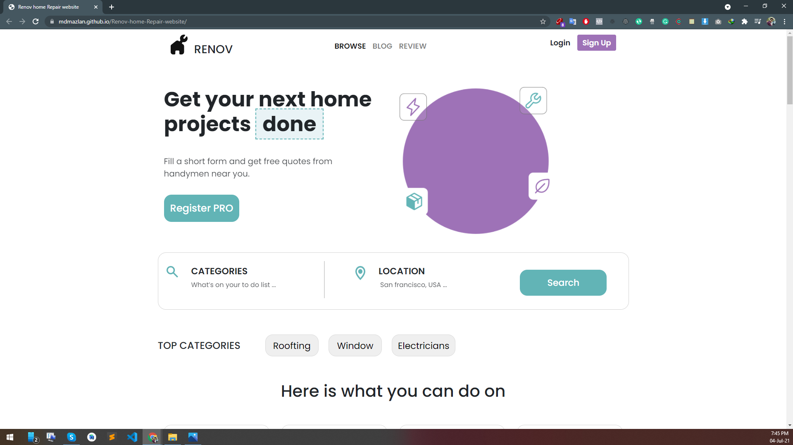

https://mdmazlan.github.io/Renov-home-Repair-website/
  <h1 align="center">XD to HTML Design</h1>
  
  
     
    
    <h2 align="left">Features</h2>
    
  * HTML 5 
  * CSS
  * Font Awesome
  * Bootstrap 5
  * Cards
  * Grid system
  * Flex
  

